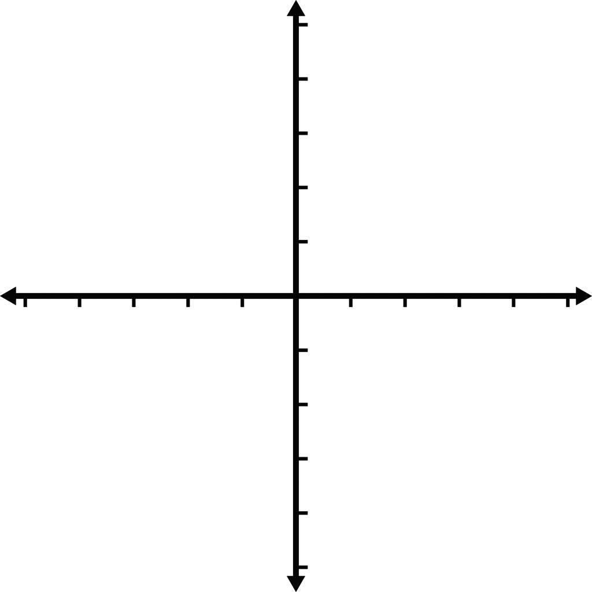

# Draw the coordinate system

In your notebook, Draw this image to the best of your ability and then answer the questions below the image.

1. Can you label the _x_ and _y_ axes?
2. Can you label the tick marks on the axes from -5 to 5?
3. Draw a point at the origin (0, 0).

Note: It's ok you don't know the answers to these questions. We will go over them in this lesson.
