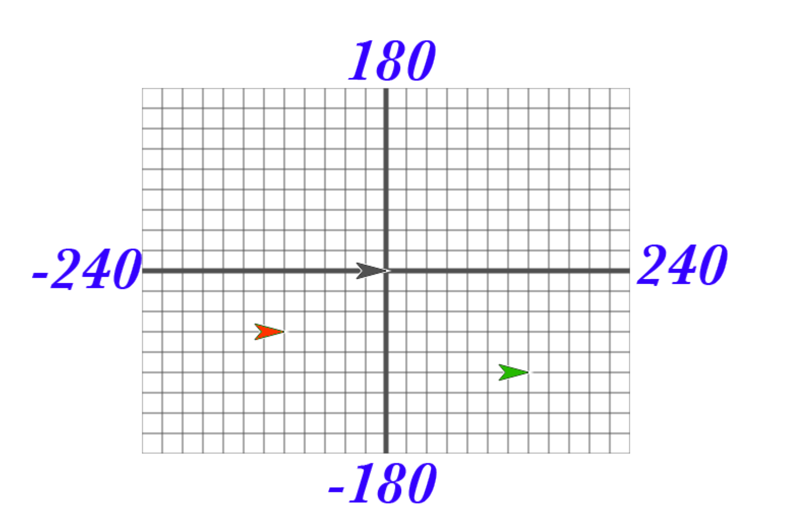

# Review the coordinate System

## Answer the following in your notebook

1. What are the coordinates of the red sprite?

2. What are the coordinates of the green sprite?

    In your window, take a look at the blocks under the motion pallette. The majority of the blocks there will help you position your sprite on the stage. Try them and see what they do! Change the input values to see what happens.

3. List at least 4 blocks from the motion pallette that will change the position of a sprite.

## Make sure you know how to use the **say** block

1. Open the development environment and start a new project.
2. Using the **say** block have your sprite say "Hello World".
3. Save your with the file name _DoNow1.1_.
