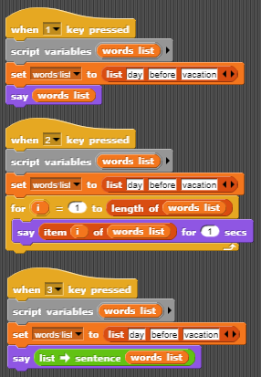

# List tracing

For each script below, describe what the sprite does when that script is triggered. Number your answers. If you have time, check your answers by assembling these scripts.

You will need to add the "words, sentences" library to your project to use the **list->sentence** block.

1. Click the File Icon in the upper left corner next to the image.  
2. Click "Libraries..."
3. Select "Words, sentences"
4. Click "Import"

    * The "list->sentence" block will be one of the blocks added to the operators palette.

        

5. Save your project as _DoNow4.5_.
