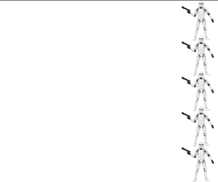

# Star Wars troopers using cloning

1. In yesterday's do now, we used a script to suplicate 5 Star Wars troopers to march across the stage.  Today we will use the clone feature to do the same thing.

2. Open this [starter script](http://snap.berkeley.edu/snapsource/snap.html#present:Username=whuangpha&ProjectName=160425%20Do%20Now%20cloning). Using the **create a clone of** block, create a script so there are 5 clone troopers that move from the right side of the screen to the left side in a straight line when green flag is clicked. The starting and ending positions of the sprites are shown below.

3. Save your project as _Donow53_.

   

## Start

  

## End

  
