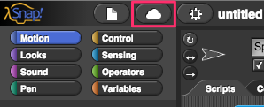
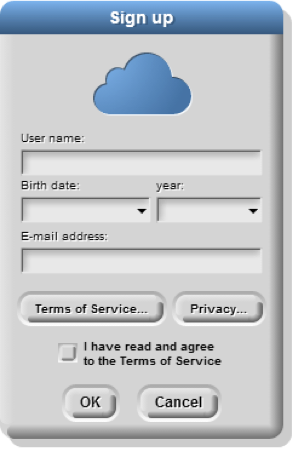

# Getting to Know You

In this lab, you will explore Snap! and create a simple "self-portrait" program to introduce yourself to your teachers and classmates.

## Part 1 - Exploring Snap!

1. Open Snap! on your computer.  The URL is [http://snap.berkeley.edu/run](http://snap.berkeley.edu/run).

2. In order to save your program, the first thing you'll need to do is to create an account. In the Snap! browser window, find the cloud-shaped button in the top toolbar on the upper left corner of the window.
    

    Click it, select the "sign up" option in the menu, and follow the instructions there. You will need to check your email after creating your account to get your initial password.  Your username will be the first part of your school email address.  If you need help, ask.
    

3. Spend a few minutes looking around, trying things out, and experience what the language can do.

4. Write down three things in your notebook you found that Snap! can do and how to do them. Be as specific as you can!

     | Snap! can do this...| If I do this... |
     | --- | --- |
     | 1.  |     |
     | 2.  |     |
     | 3.  |   |

5. Find a partner and compare notes.  Share your findings with your partner and ask them about what they learned.  Write down the three capabilities your partner found below.

     | Snap! can do this... | If I do this... |
     | --- | --- |
     | 1.  |     |
     | 2.  |     |
     | 3.  |     |

## Part 2 - Snap! self - portrait

Using what you've learned and other things you might discover, create a Snap! program that describes yourself. This can take whatever form and use whatever Snap! tools and blocks you want. Make sure that somehow, at some point in your program you show the following information:

    * Your name
    * Your current grade
    * Your age
    * Your favorite subject in school
    * One of your hobbies or interests
    * Any previous programming or computer experience you have
    * Example of something you learned
    * What you think learning CS will be like.
    * What are some of your favorite uses of technology

7. Submit your _self portrait_ using the submission instructions of your instructor. If you are having trouble saving, here is a great video:  [https://youtu.be/VHts_QAp3XU](https://youtu.be/VHts_QAp3XU)

## Grading scheme/rubric

| **Criteria** | Point values |
| --------- | --- |
| **Part 1** | |
| 1.4 Listed 3 things you found Snap! can do. | 0.3 points |
| 1.5 Listed 3 things your partner found Snap! can do. | 0.3 points     |
| **Part 2** | |
| Includes name | 0.2 points |
| Current grade | 0.2 points |
| Age | 0.2 points     |
| Programming or computer experience | 0.0 points |
| Learning CS going to be like | 0.2 points |
| Favorite uses of technology | 0.2 points |
| Favorite subject in school | 0.2 points |
| Example of something learned | 0.2 points |
| Hobby or interest | 0.2 points |
| **Total** | **2.2 points** |
