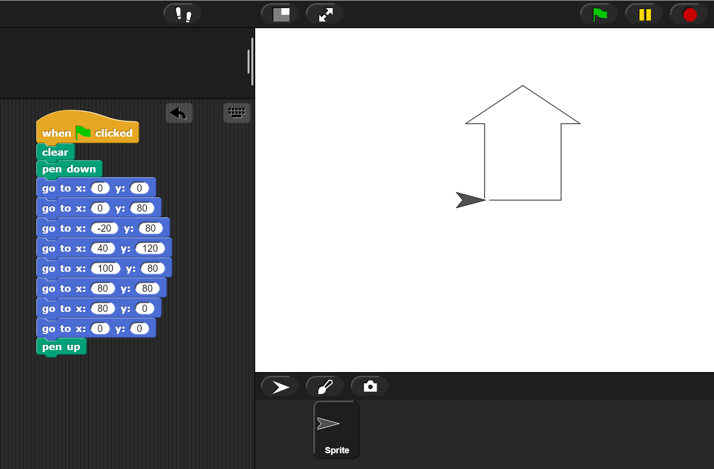

# Getting to know Coordinates

## Part 1 - Coordinates

1. Open the [Peabody test](https://snap.berkeley.edu/snap/snap.html#present:Username=aspiece%40gmail.com&ProjectName=PeabodyTest).
2. Click on Peabody to start the test.
3. Answer his question in the textbox.
4. You should answer at least 10 of his questions.

## Part 2 - Plot a drawing using a template

1. Using this [starter script](https://snap.berkeley.edu/snap/snap.html#present:Username=aspiece%40gmail.com&ProjectName=Snap%20Coordinate%20System%20Intro) from the classroom activity, create a drawing that has at least 10 coordinates.

2. Save your project as _Lab0.5_.

    Here is an example with 8 coordinates:

    

## Grading rubric

| **Criteria**                                          |   Points             |
| ------------------------------------------------------------- | -------------- |
| **Part 1**                                                        |   |
| Participated in the Peabody test                            | 0.5 points     |
| **Part 2**                                                        |                |
| Saves project                                                 | 0.25 points    |
| Shares link with teacher                                      | 0.25 points    |
| Drawing contains at least 10 coordinates                      | 0.5 points     |
| Drawing completeness (Resembles something recognizable)       | 0.5 points     |
| **TotalL**                                             | **2 points**   |
