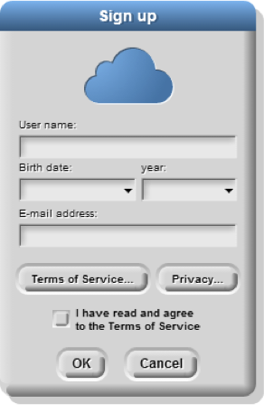

# Lab 1.1 - Welcome To Snap!

Snap is a programming language, which you can use to tell a computer what to do. A program is a particular set of instructions for the computer to follow.

Programs in most languages use only letters (and punctuation), but snap is different: it's a visual language. Instead of writing a program only using the keyboard, you will drag pictures of blocks and click them together.

>The following is a program in Snap!: 

>

>**Can you guess what it might do? (Write your guess below)**
 
>---

Snap is different than many other languages in another way— you run it in a web browser like Firefox or Chrome. The url that you can use to always get to Snap! is

**http://snap.berkeley.edu/run**

In order to save your programs, the first thing you'll need to do is make an account. In the snap browser window, Find the cloud-shaped button in the top toolbar on the upper left corner of the window:

Click it, select the "sign up" option in the menu, and follow the instructions there. You will need to check your email after creating your account to get your initial password.

## 1. Overview of the Window

You may have noticed that there are a few main sections of the Snap! window. These regions are named as shown below. 

## 2. Blocks
The area at the left edge of the window is the palette. As you see in the picture, it contains tabs for eight different-color block categories. In this lab, we will focus on the Motion, Sound, Pen, and Sensing tabs. You will learn about the other tabs in the next few labs. 

These tabs are an important organizational structure in snap because they are home to the various blocks that you will use to tell the computer what to do. The blocks are categorized under each tab based on what kind of thing each block does. 

> **2.1) Below, fill in the name of the category to which each block belongs:**

> | Block | Category |
  | -- | -- |
  | |  |
  | |  |
  | |  |
  | |  |
  | |  |
  | |  |
  | |  |
  | | &nbsp; |
