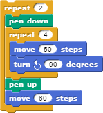

# Lesson 2.2: Nested loops

## Learning objectives

Students will be able to...

* Apply nested loops to solve programming problems.

## Materials and preparation

* [Do now 2.2](do_now_22.md).
* [2.2 slide deck](https://github.com/TEALSK12/introduction-to-computer-science/raw/master/slidedecks/TEALS%20SNAP%202.2.pptx)
* [Lab 2.2 - Yellow brick road](lab_22.md) ([docx](https://github.com/TEALSK12/introduction-to-computer-science/raw/master/Unit%202%20Word/Lab%202.2%20Yellow%20Brick%20Road.docx)) ([pdf](https://github.com/TEALSK12/introduction-to-computer-science/raw/master/Unit%202%20PDF/Lab%202.2%20Yellow%20Brick%20Road.pdf)).
* [Snap! tips][]: 0, 3, 7, 9, 10, 14, 15, 16, 17
* Video resources
  * [https://youtu.be/bons028VLEU](https://youtu.be/bons028VLEU)
  * [https://youtu.be/Y5lZQRawsFk](https://youtu.be/Y5lZQRawsFk)
  * Video Quiz - See Additional Curriculum Materials accessed from the TEALS Dashboard.

## Pacing Guide

| Duration   | Description                                   |
| :---------- | :--------------------------------------------- |
| 5 minutes  | Welcome, attendance, bell work, announcements |
| 15 minutes | Review, lecture, and examples                 |
| 25 minutes | Yellow brick road Activity      |
| 10 minutes | Debrief and wrap-up                           |

## Instructor's notes

### Review

Prompt students to restate the definition of **loop**.

* A type of block that causes other code to run multiple times in succession.

Prompt students to explain why loops are useful in programming.

* To reduce code redundancy and increase readability when dealing with repetitive tasks.

Ask for examples of problems that can be solved with loops.

* Drawing polygons, repeating an action, etc..

Ask students how their scripts to draw shapes improved when they introduced loops.

* Code became shorter and more readable.
* Small changes, such as altering the size of the shape, became simpler.

### Lecture

Ask students to consider the problem of drawing two squares next to each other. Work through writing a script to do this.  The likely result will duplicate the script to draw a single square:

  

* Remind students to remember what they previously learned and use loops.
* Once the script is complete, ask students if there are ways they could improve it.

Discuss what would happen if you needed to draw 10 squares, or 100, or an unknown number.

* If students seem capable, you can allude to user input for the unknown number example, but do not get into details at this point.

Ask if loops can somehow be applied to reduce redundancy even further in the script to draw two squares.

#### Introduce the concept of nested loops

Define **nested loop:**

* A loop used inside the body of another loop.

Point out that there is nothing particularly special happening here

* The body of a loop can contain any script, including another loop.
* Emphasize that the inner loop will run all its iterations _each time_ the outer loop runs.

* Walk through rewriting the script to draw multiple squares to use nested loops:

  

Ask how many total times the sprite will move 50 steps.

* The sprite will move 50 steps 8 times (4 * 2).

Show that the number of squares drawn can be easily changed by simply changing the number of times the outer loop iterates.

### Activity

Direct students to complete the [Yellow Brick Road](lab_22.md) activity individually or in pairs. Try to pair students that have not previously interacted.  

* Remind students to continue using the principles learned with basic loops.

Encourage students to write scripts that are as short and succinct as possible while still being functional and readable.

### Debrief

Show a student's solution.

* Either request a volunteer.
* Point out uses of nested loops.

Ask students to describe how loops, specifically nested loops, made the assignment easier.

* Each brick, or at least each row, would have needed to be scripted separately creating much longer scripts.

Ask students to think about what part of the script would need to change to alter the size of each brick or the size of the road and how that was made easier with loops.

* Size of road: number of iterations in one or both loops.
* Size of brick: one or both move blocks **and** number of iterations in one or both loops.
* Without loops, the change would have been needed in many different places.

## Accommodation and differentiation

Not all students will recognize all the possible places to use nested loops in the final program.  Encourage students to find as many places to use a nested loop as possible, but allow struggling students to focus on just one or two uses.

Advanced students can be encouraged to change the size of the bricks, which will require not only altering the number of steps moved but also the number if iterations in the loops.  You can also ask students to draw a building/house using only squares.  For example, they can be instructed to draw where they live, favorite building, or school.  

[Snap! tips]: https://github.com/TEALSK12/introduction-to-computer-science/blob/master/Snap%20Tips.docx?raw=true