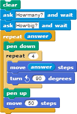

# Lesson 2.3: Inputs and conditionals

## Student objectives

Students will be able to...

* Apply **ask** and **receive** blocks.
* Apply simple conditional, **if** and **if-else** blocks, to alter control flow in a program.

## Materials and preparation

* [Do now 2.3](do_now_23.md).
* [2.3 slide deck](https://github.com/TEALSK12/introduction-to-computer-science/raw/master/slidedecks/TEALS%20SNAP%202.3.pptx)
* [Lab 2.3 - What shape is that?](lab_23.md) ([docx](https://github.com/TEALSK12/introduction-to-computer-science/raw/master/Unit%202%20Word/Lab%202.3%20What%20Shape%20Is%20That.docx)) ([pdf](https://github.com/TEALSK12/introduction-to-computer-science/raw/master/Unit%202%20PDF/Lab%202.3%20What%20Shape%20Is%20That.pdf))
* [Snap! tips][]: 0, 3, 7, 9, 10, 14, 15, 16, 17
* Video resource - [https://youtu.be/t3k3wOxO1xI](https://youtu.be/t3k3wOxO1xI)
  * Video quiz: See additional curriculum materials accessed from the TEALS dashboard.
* [Flocabulary](https://www.flocabulary.com/unit/coding-conditionals/)

## Pacing guide

| Duration   | Description    |
| :---------- | :--------------------------------------------- |
| 5 minutes  | Welcome, attendance, bell work, announcements |
| 20 minutes | Lecture  |
| 20 minutes | Lab activity |
| 10 minutes | Debrief and wrap-up                           |

_Note: This lesson may cover too much material for some classes to handle in one day.  Feel free to spill over into a second day, splitting the material however works best for your class._

## Instructor's notes

### Lecture

Point out that, so far, our scripts have had minimal interactivity. There was _some_ user interaction in the shape drawing labs, but no back and forth. Just pushing a key to trigger an action.

* This is not normally how scripts work.

Ask students for examples of interactive computer programs.

Ask students for suggestions for making previous labs or activities more interactive. There are no right or wrong answers here. The goal is to get students thinking about interactivity.

Introduce the **ask_and wait** block.

  

Demonstrate that it functions similar to the **say** block but waits for a response from the user.

  

The response is stored in the **answer** block and can be referenced later.

  

Variables will not be introduced until unit 3, so this block will be somewhat magical for now.  You should judge your students' preparedness to handle the details and act accordingly.

* Emphasize that only one input is stored at a time, and that asking a new question deletes the previous answer.
* For example, the following script, intended to draw a bunch of squares where the user specifies both the size and the number of squares, will not work as intended:

    

#### Introduce conditional statements

Define **conditional** - a block used to make a choice between executing two different chunks of script.

You can also use this [video on conditionals](https://www.flocabulary.com/unit/coding-conditionals/) by Flocabulary.

* Point out the differences between **if** and **if/else** block.

    

    

* Namely, if-else provides a choice between two script paths, whereas if simply chooses between executing script or not
* Emphasize that **only one** of the bodies, either the if or the else, will ever be executed.

Show students the relational operators (<, >, and =).

  

  
  
  

### Activity

Direct students to complete the [What shape is that?](lab_23.md) activity individually or in pairs.

### Debrief

Discuss one or two students solutions.

* Point out differences between the approaches of different students and lead discussion about advantages and disadvantages.
* Place particular emphasis on the choice between if and if-else blocks.

Explain that, when conditions are mutually exclusive (as in part 2.1), a series of if vs. if-else blocks can be functionally equivalent.

* When the conditions are not mutually exclusive (as in part 2.2), the choice matters more.

## Accommodation and differentiation

Advanced students can be encouraged to add extra functionality, such as attempting to draw the shape the user is specifying or identifying types of triangles (equilateral, isosceles, scalene)

Students who are struggling can be allowed to skip some parts of the tables in 2.1 and 2.2, focusing on just a few cases

## University of California - Berkley teacher support resources

[BJC Lecture 13: Mislabeled as 14) Human-Computer Interaction Bjorn Hartman](https://www.youtube.com/watch?v=3VZ7D01T2Yc)

* Bjorn Hartman Background 0:00-3:30
* Human Computer Interface(HCI) 3:45-6:00
* HCI: Design, Computer Science, Applied Psychology 6:00-8:00
* Iterative Design Cycle 8:00-10:30
* Understanding Users 10:35-11:35
* Prototype Interface Examples 11:40-14:00
* Evaluation (Formative, Summative) 14:50
* [Why Study User Interfaces](http://www.youtube.com/watch?v=3VZ7D01T2Yc&t=15m0s)
  * Ex:Mouse Xy axis, Sketchpad, PC, Tablets 15:00-25:00
* What had changed? Research: Mainframe to Ubiquitous Computing 25:00-29:30
* [Example Project: Using Dexterity for Computer Interface Video](http://www.youtube.com/watch?v=3VZ7D01T2Yc&t=28m30s) 28:30-29:30
* Zipf/Power Law Distribution 30:00-32:00
* HCI Research at Berkeley 32:10-46:25
* [Multi Touch Apps and Toolkits](http://www.youtube.com/watch?v=3VZ7D01T2Yc&t=32m0s) 32:00-End

[Snap! tips]: https://github.com/TEALSK12/introduction-to-computer-science/blob/master/Snap%20Tips.docx?raw=true
