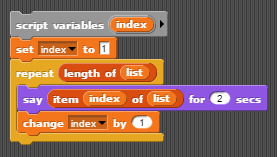

# Lesson 4.3: List practice I

## Learning objectives

Students will be able to...

* Traverse a list, accessing each element one at a time.
* Perform operations combining all elements in a list.
* Select defined subsets of elements in a list.

## Materials and preparation

* [Do now 4.3](do_now_43.md)
* [4.3 slide deck](https://github.com/TEALSK12/introduction-to-computer-science/raw/master/slidedecks/TEALS%20SNAP%204.3.pptx)
* [Lab 4.3 - Guess who](lab_43.md) ([docx](https://github.com/TEALSK12/introduction-to-computer-science/raw/master/Unit%204%20Word/Lab%204.3%20Guess%20Who.docx)) ([pdf](https://github.com/TEALSK12/introduction-to-computer-science/raw/master/Unit%204%20PDF/Lab%204.3%20Guess%20Who.pdf))
* [Snap! tips][]: 0, 19

## Pacing guide

| Duration   | Description                                   |
| :---------- | :--------------------------------------------- |
| 5 minutes  | Welcome, attendance, bell work, announcements |
| 15 minutes | Lecture and demonstration                     |
| 30 minutes | Lab activity                            |
| 5 minutes  | Wrap-up                                       |

## Instructor's notes

### Lecture

In small diverse groups, ask students to consider how to count the number of students with July birthdays in the room.

* Provide only a few minutes to work through this-- students need not write full, formal algorithms, but simply describe an approach.

* Have groups share with each other and work together to come up with a single approach, hopefully settling on asking each student if s/he has a July birthday and counting the number of yeses (or something similar).

Define _traversal_ as the process of accessing each element of a list in order and performing some operation.

* Explain that the operation can be anything, and may not actually be performed on every element.

Provide a few examples of possible operations (say each person's name, count the number of females, add up the total number of siblings, find the average GPA, etc.)

Explain that traversing is how many problems involving lists are solved.

As a group, develop sample script for a simple list traversal, such as the following:

Ask leading questions to help students write each line of the script, one a time, then gradually put the pieces together ("build up" approach).

* Point out that the **say** block can be replaced by any script (including larger blocks of scripting for more complex operations), but that the rest of the script will typically be the same.
* Emphasize that the _index_ variable is keeping track of where we currently are in the list, and can be used in the traversal operation if wanted, as in:

  

### Activity

Students should complete the [guess who](lab_43.md) activity individually or in pairs.

Students will be performing several traversal operations, some of which simulate mapping, filtering, or reducing/folding the list.  You can discuss these operations if you feel the class can handle it.

Part 1.3 requires use of the **join** block. Be sure that the students are comfortable using this block.

### Wrap-up

Ask students to briefly describe how the various parts of the lab were similar or different.

* Hopefully the students find that the scripts were quite similar for each part.

Ask students to describe something they found challenging about the lab.

* You will go over the correct solutions to the lab in the next lesson.

## Accommodations and differentiation

Advanced students can attempt more complex filters in part 2.3 (such as finding all names that contain at least two vowels) and/or more advanced maps in part 1.3 (such as greeting each person by first initial).

Struggling students should focus on parts 1.2, 2.1, and select items from part 2.3.  Partial script can be provided.

## University of California - Berkley teacher support resources

[BJC Lecture 9: Recursion](https://www.youtube.com/watch?v=JKn3nsfzBdA)

* Recursion 0:50-1:40
* Recursion Demo in Snap! 1:40-17:00
* Overview 17:00-21:00
* Definition of Recursion 21:00-24:30
* Examples of Recursion (You Already Know It!) 24:30-26:20
* Trust the Recursion 26:22-29:40
* Summary of Recursion 29:40-End

[Snap! Tips]: https://github.com/TEALSK12/introduction-to-computer-science/blob/master/Snap%20Tips.docx?raw=true
