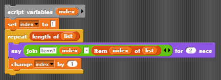

# Lesson 4.3

## Learning Objectives

Students will be able to...

* Traverse a list, accessing each element one at a time
* Perform operations combining all elements in a list
* Select defined subsets of elements in a list

## Materials/Preparation

* [Lab 4.3 handout (Guess Who)](lab_43.md) 

## Pacing Guide

| Duration | Description |
| -- | -- |
| 5 minutes | Welcome, attendance, bell work, announcements |
|15 minutes	| Lecture and demonstration |
|30 minutes | Guess Who Activity |
| 5 minutes | Wrap-up |

## Instructor's Notes

* Lecture
  * Ask students to consider how to count the number of female students in the room
    * As a group, work through an algorithm with the students, hopefully settling on asking each student if s/he is female and counting the number of yeses (or something similar).
  * Define "traversal" as the process of accessing each element of a list in order and performing some operation
    * Call out that the operation can be anything, and may not actually be performed on every element
    * Provide a few examples of possible operations (say each person's name, count the number of females, add up the total number of siblings, find the average GPA, etc.)
    * Explain that traversing is how many problems involving lists are solved.
  * Present sample code for a simple list traversal, such as the following:  
  
    * Point out that the "say" block can be replaced by any code (including larger blocks of code for more complex operations), but that the rest of the script will typically be the same
    * Emphasize that the "index" variable is keeping track of where we currently are in the list, and can be used in the traversal operation if wanted, as in:  
    	

* Activity
  * Students should complete the "Guess Who" activity individually or in pairs
    * Students will be performing several traversal operations, some of which simulate mapping, filtering, or reducing/folding the list.  You can discuss these operations if you feel the class can handle it.
    * Part 1.3 requires use of the "join" block&mdash;be sure that the students are comfortable using this block.
* Wrap-up
  * Ask students to briefly describe how the various parts of the lab were similar or different
    * Hopefully the students find that the scripts were quite similar for each part.
  * Ask students to describe something they found challenging about the lab
  * You will go over the correct solutions to the lab in the next lesson 

## Accommodations/Differentiation

* Advanced students can attempt more complex filters in part 2.3 (such as finding all names that contain at least two vowels) and/or more advanced maps in part 1.3 (such as greeting each person by first initial).
* Struggling students should focus on parts 1.2, 2.1, and select items from part 2.3.  Partial code can be provided.
