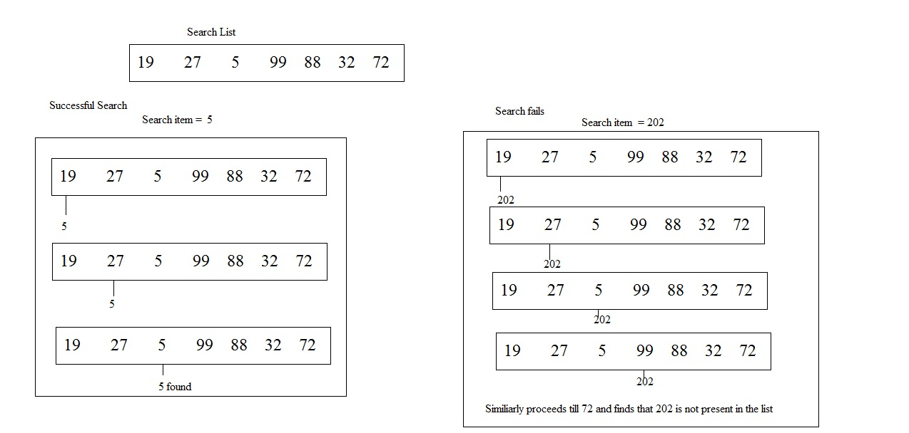

# Lesson 4.5: Sequential search

## Learning objectives

Students will be able to...

* Explain the sequential search algorithm.
* Implement several variations of sequential search.

## Materials and preparation

* Prepare a set of cards with different words or images on them. This could be a deck of playing cards, or simply index cards with numbers, letters, or names on it.
* [Do now 4.5: List tracing](do_now_45.md)
* [4.5 slide deck](https://github.com/TEALSK12/introduction-to-computer-science/raw/master/slidedecks/TEALS%20SNAP%204.5.pptx)
* [Lab 4.5 - It's around here somewhere](lab_45.md) ([docx](https://github.com/TEALSK12/introduction-to-computer-science/raw/master/Unit%204%20Word/Lab%204.5%20Its%20Around%20Here%20Somewhere.docx)) ([pdf](https://github.com/TEALSK12/introduction-to-computer-science/raw/master/Unit%204%20PDF/Lab%204.5%20Its%20Around%20Here%20Somewhere.pdf))
* [Unit 4 tips](unit_4_tips.md)

## Pacing Guide

| Duration   | Description                                   |
| :--------- | :--------------------------------------------- |
| 5 minutes  | Welcome, attendance, bell work, announcements |
| 15 minutes | Lecture and demonstration                     |
| 25 minutes | It's Around Here Somewhere Activity           |
| 10 minutes | Debrief and wrap-up                           |

## Instructor's notes

### Lecture

Show students the set of cards you prepared. Explain that each card has a (number, word, name, picture, etc) on it. Ask the students to devise a method that can correctly determine whether a particular (number, word, name, picture) appears somewhere in the set of cards.

* Press the students to come up with a repeatable method that will always work, including when the value you are searching for is not present.  If necessary, ask them to pretend they are a computer.
 Point out that solutions like "look at all the cards" are too high-level, and in reality, there is a lot more going on (such as looking at each one at a time).

There are many ways of searching the set of cards. Some students may come up with novel solutions, like:
* sorting the cards into some kind of order first
* dividing up the cards into smaller groups and giving each smaller group to a different student to check
 
Guide students to the straightforward process of checking each card in a sequential order until they have either found the card they are looking for or checked every card.  Emphasize that the absence of the card is only confirmed when every card has been checked, but that its presence is known as soon as the it is found.

* Point out that this process is a traversal of a list of cards.

Explain that the process of traversing a list looking for a particular item is known as a "sequential search."

Ask students to think about the efficiency of this algorithm.  Emphasize best, worst, and average cases (both what those cases are and how long they take).

* students should have a basic understanding of the fact that the speed of the search is dependent on the size of the list.
* If students seem prepared, ask them to speculate under what circumstances you might be able to do better (eventually leading to binary search).

Show the script for a basic sequential search:
  

* Point out that this script is another variation of a traversal.
* Emphasize that this is only one variant of sequential search.  The specifics of what to report can vary (true/false, index in list, item itself, etc.).

### Activity

Students should complete the [It's around here somewhere](lab_45.md) activity individually or in pairs.

* Each part asks students to write a slightly different sequential search.  In all cases, make sure students are clear on what they should be reporting, both when the desired item is found and when it is not.

### Debrief

Ask one or two students to provide their solutions to each part.

* Point out the similarities in each solution, emphasizing that the algorithm remains constant and only the value that is reported changes.

## Accommodations and differentiation

Advanced students can be encouraged to explore more efficient searching algorithms (specifically binary search).

Struggling students should focus on just parts 1.1 and/or 2.1 of the lab.  Remind these students that they are starting with a traversal and simply changing what happens to each item.
