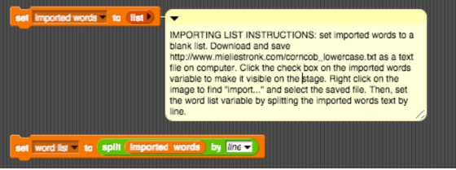

# Project 4: Guess my word

Students will implement a Snap! "Guess my word" word game.

## Overview

In Guess My Word, one player (the "chooser") chooses a secret word and another player (the "guesser") attempts to guess the word one letter at a time.  If a guessed letter appears in the word, all instances of it are revealed.  If not, the guesser loses a chance.  If the guesser figures out the secret word before he or she runs out of chances, he or she wins.  If not, the player who chose the word wins.  Chances are tracked using a figure drawing of your choice. You can build a bear or build an ice cream cone, or disassemble a snowman, be creative.  The figure is drawn one part at a time, and the guesser loses when the entire figure has been drawn or disappears. This game is also the basis for the TV game show Wheel of Fortune.

### Behavior

#### Game play

In this implementation of Guess my word, the computer will take on the role of the "chooser" and the human player will be the "guesser."  The computer will secretly choose a word from a list (see below) and show the player how many letters are in the word by displaying a sequence of blanks (underscores).  Then, the computer will begin asking for guesses.  If the player guesses a letter that is in the secret word, all blanks representing an instance of that letter should be replaced by the letter.  If the guessed letter is not in the word at all, the player should lose a chance and a new part of the figure being built should appear or disappear if figure is being disassembled.  If the player guesses a letter he or she has already guessed, he or she should not lose a chance, even if that letter is not in the word.  If the player guesses all letters in the word, he or she wins.  If the figure being built is completed, the player loses.  In either case, the secret word should be revealed after the game is over.

#### Sprites

Your game will need to include at least three sprites: the figure being built or disassembled, a "host" sprite that asks the player for a guess and informs him or her whether the guess is correct, and an "assistant" sprite that tells the player the status of the secret word.  You may use more sprites if you think they are appropriate. The host and assistant should have clear roles and should never do each other's job.

#### Word status

As the game is played, the player should be shown the current guessed status of the secret word.  Letters that have been correctly guessed should be shown in the correct locations.  Unguessed letters will appear as blanks.  At the beginning of the game, no letters will have been guessed, and the only information shown to the player will be a sequence of blanks, with one blank for each letter in the secret word.  As the player guesses letters correctly, blanks representing guessed letters should be replaced by those letters.  So, for example, if the secret word is "screwdriver" and the player has guessed `e`, `s`, `r`, and `d`, the current word status would be: `s _ r e _ d r _ _ e r`.

#### Chances

The player will have six "chances" to guess the word.  Guessing a correct letter does not cost a chance.  Each missed chance will cause a new piece of the figure being built to appear or disappear if figure is being disassembled. The six pieces will depend on the  figure you choose.  Example 1, a snowman can have the following parts: head, eyes, left arm, right arm, middle snowball, and bottom snowball.  Example 2, a bear can have the following parts: head, body, left arm, right arm, left leg, and right leg.  Example 3, an ice cream cone can have the following parts: cone, 2 scoops of ice cream, fudge, sprinkles, and a cherry. If you would like to be more creative with the appearance, feel free to do so.  No matter what your figure looks like, though, it should include these six pieces and no more.

#### Game end

The game can end in one of two ways:

* If the player has guessed the complete secret word, he or she wins.
* Otherwise, if the player has run out of chances and the complete figure has been drawn, or disassembled as in the Snowman sample solution the player loses.

In either case, when the game ends the host should stop asking for guesses.  The host should inform the player whether he or she won or lost, and the assistant should reveal the entire secret word.

#### Video example

Here is a sample of a simple version of the game being played - [https://youtu.be/H3djon837cc](https://youtu.be/H3djon837cc)

### Implementation details

#### Word list/secret word

You will be provided with a list of words from which the secret word should be chosen for each game.  Instructions for importing the word list:

* To import the list, set a variable "imported words" to be a list.
* [Download and save](wordlist.txt) as a text file on your computer.
* Click the checkbox on the "imported words" variable so that it is visible on the stage.
* Right click on the stage image to find the 'import...' command. Select the correct file to import.
* Set another variable to be a list of words by splitting the imported words by line.

    

#### Documentation

In addition to functioning well, your program must be well-documented and readable.  This includes, but is not limited to, things such as:

* organizing your scripts so that they can be read and comprehended easily
* giving  your sprites meaningful names
* naming and using your variables, lists, and custom blocks well
* including comments to describe the structure of your program and any particularly complex or unintuitive pieces of code

#### Required Snap! elements

Your program must include, at a minimum, the following Snap! code elements:

* At least two lists, once of which must be used to track guessed letters
* Custom blocks as appropriate, including arguments and reporters

## Required checkpoints

1. Be able to select a secret word, keep track of which letters have been guessed, determine if each letter guessed is in the secret word or not
2. Be able to  announce the current status of the word, showing letters that have been guessed and blanks for other letters.
3. Be able to play a full game of Guess My Word, identify correct and incorrect letters, display the figure, and inform the player whether they have won or lost.

## Grading Scheme/Rubric

| Functional correctness (behavior)      |            |
| ------------------| ---------- |
| Computer randomly chooses a secret word | 1 point    |
| Host repeatedly asks for a letter and announces whether that letter is in the secret word                        | 2 points   |
| Assistant displays the correct secret word status after each guess                                               | 4 points   |
| Player loses a chance and a piece of the figure appears when a guess is incorrect                               | 3 points   |
| Host informs player when he or she guesses a letter that has already been guessed; player does not lose a chance | 2 points   |
| Game ends with player victory if the entire secret word is guessed                                               | 2 point    |
| Game ends with player defeat if the player runs out of chances                                                   | 2 point    |
| Secret word is revealed when game ends                                                                           | 1 points   |
| **Subtotal**                                                                                                           | **17  points** |
| Technical correctness (implementation)                                                                           |            |
| Program is well-designed visually and has a consistent theme                                                     | 2 point    |
| Program is well-documented and exhibits good style                                                               | 2 points   |
| Program shows good creativity and effort                                                                         | 3 points   |
| Program includes at least two lists                                                                              | 2 points   |
| Program uses custom blocks with arguments and reporters appropriately                                            | 2 points   |
| Program tracks guessed letters using a list                                                                      | 2 points   |
| Obtain and respond to playtest feedback from a parent or guardian                                                | 2 points   |
| Checkpoint 1 (4/30)                                                                                              | 4 points   |
| Checkpoint 2 (4/30)                                                                                              | 4 points   |
| **Subtotal**                                                                                                     | _19 points_  |
| **Total**                                                                                                           | **40 points**  |
