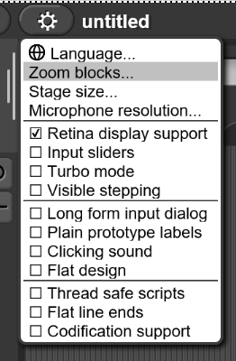
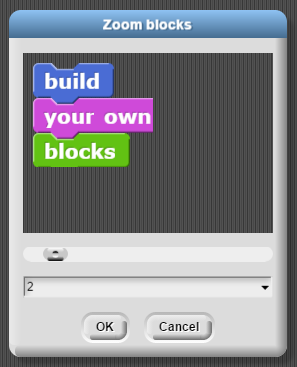

# Readability

## Zoom Blocks

Zoom blocks option lets you change the size of blocks, both in the block categories and in script. Snap! remembers your zoom preferences after you set them.

The standard size is 1.0 units. The main purpose of this option is to let you take very high-resolution pictures of scripts for use on posters. It can also be used to improve readability when projecting onto a screen while lecturing, but bear in mind that it doesn’t make the palette or script areas any wider, so your computer’s command-option-+ feature may be more practical.  

## How to Access

### Step 1

Clicking the gear icon in the Snap! toolbar opens the settings menu. Zoom Blocks is the second option within this menu.

### Step 2

Opening zoom blocks allows you to see the settings for the block size. To change the sizing you can drag or select the sizing options from a dropdown menu. Once you accept these changes Snap! Will remember this selection.