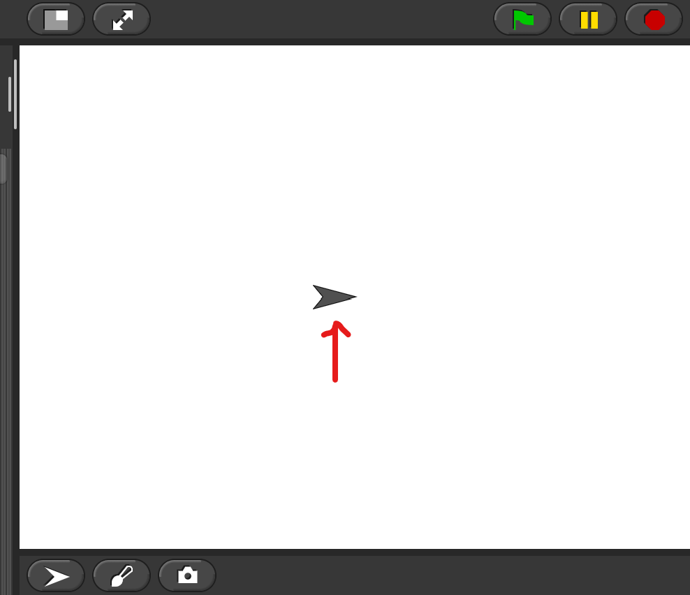
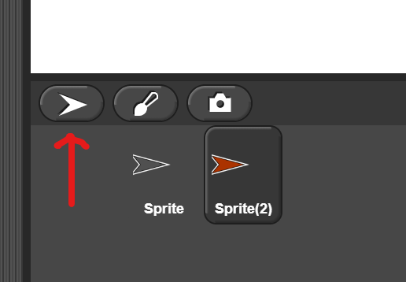
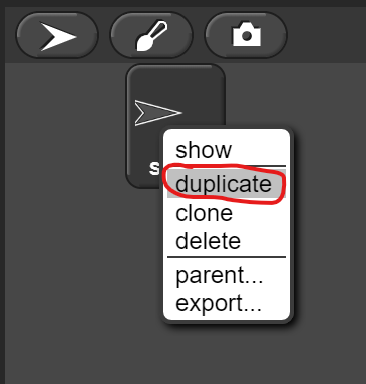

# Sprites

## Sprites

Every time you start a new Snap project, you will see something shaped like an arrowhead in the center of the [stage](../glossaryv2.md#stage). 

The sprite is controlled by [blocks ](../glossaryv2.md#block)in the scripting area. 

If you want to add a new [sprite ](../glossaryv2.md#sprites)to your project, you can click on the sprite tab at the bottom left of the [stage](../glossaryv2.md#stage)[.](onenote:Glossary.one#Glossary&section-id={ba801250-2f51-4298-b46b-61766397c088}&page-id={4f4bc1f4-7daf-4753-b41d-64837a46a197}&end) 

All of the sprites for your project will appear as icons below the stage. If you want to duplicate a sprite, right-click on its icon and select "**Duplicate**." 

