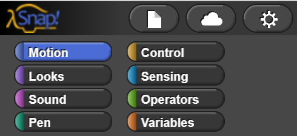

# Snap Block Categories

## Categories

All of the [blocks](../../glossary.md#block) in Snap are organized into palettes. Each category is a different color. You can access each palette by clicking on the tabs at the top left of the [Snap Window](../how-to/snap-window.md).

* [Motion](motion.md)
* [Looks](looks.md)
* [Sound](sound.md)
* [Pen](pen.md)
* [Control](control.md)
* [Sensing](sensing.md)
* [Operators](operators.md)
* [Variables](variables.md)