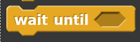
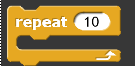
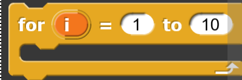
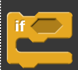
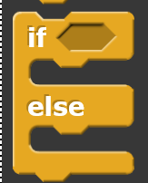
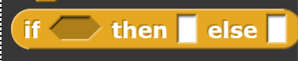

# Control
Blocks in this category organize the flow of scripts. They dictate when scripts start and provide functions to loop over blocks or only execute blocks in certain cases. 

## Wait 

## Wait until

## Forever

## Repeat

## Repeat until

## For loop

## If statement

## If – else statement

## If-then-else statement

## Report 

## Stop

## Run

## Launch

## Call

## Tell

## Ask

## Run with continuation

## Call with continuation

## When the sprite starts as a clone

## Create a clone

## A new clone

## Delete this clone

## Pause all
