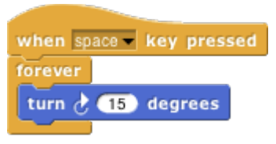
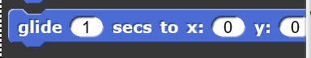

# Motion

Blocks in this category deal with the movement of sprites. They can be used to change the x and y position of the sprite as well as what direction the sprite is facing. Note: the Stage does not have any Motion blocks since it is a still object. 

## Move

## Turn clockwise

The **Turn clockwise** block rotates the sprite clockwise specified number of degrees defined by the **Degree** parameter.

| Parameter | Visual | Definition |
|:- |:- |:- |
| Degrees |  | An integer that defines the degree of clockwise rotation |

| Example | Definition |
|:- |:- |
|  | When you press the space key, the sprite should turn clockwise forever in a circle in a 15 degree increments|

## Turn counter clockwise

## Point in direction

## Point towards

## Go to a coordinate

## Go to

## Timed gliding to a coordinate

## Change x by

## Set x to

## Change y by

## Change y to

## If on edge, bounce

## X position

## Y position

## Direction
