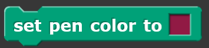
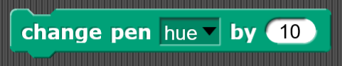
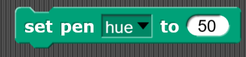
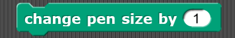
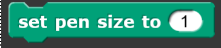
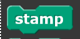
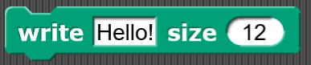

# Pen
Blocks in this category deal with a sprite's pen, which is located at the center of a sprite. The pen allows a line to be drawn following the sprite's motion. Some blocks include lifting the pen up and down, setting the pen color and changing the size of the pen.

## Clear

## Pen down

## Pen up

## Pen down?

## Set pen color

## Change pen color setting

## Set pen color setting

## Pen color properties

## Change pen size

## Set pen size 

## Stamp

## Fill

## Write something at a certain size

## Pen trails
