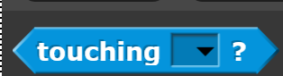
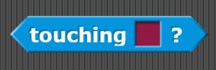
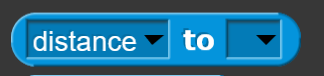
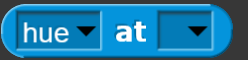
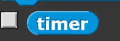

# Sensing
Blocks in this category deal with the current conditions of sprites, the mouse, and the stage. For example, they can detect when sprites are touching, when one color is touching another or the current x and y position of the mouse. 

## Touching an object

## Touching color

## Color is touching color

## Ask and wait

## Answer

## Mouse x

## Mouse y

## Mouse down?

## Key pressed?

## Distance/direction to mouse-pointer/center

## Color setting at mouse-pointer/sprite

## Reset timer

## Timer

## Costume of stage/sprite

## Sprite properties

## Object

## Url

## Microphone

## Video on

## Set video transparency

## Is a specific video setting on?

## Set video setting to

## Current date/time
