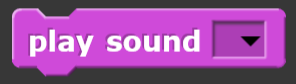
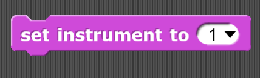
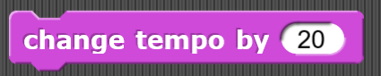
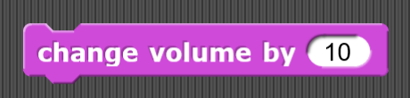
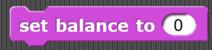

# Sound
Blocks in this category are used to play various sounds. They can also be used to change the volume or duration of a sound or the instrument playing the sound.

## Play sound

## Play sound until done

## Stop all sounds

## Play sound at frequency

## Properties of sound

## Rest for set amount of beats

## Play a note for set amount of beats

## Set instrument

## Change tempo by a set integer

## Set tempo to a specific beats per minute

## Tempo

## Change volume by a set integer

## Set volume to a certain percentage

## Volume

## Change balance by a set integer

## Set balance to a set integer

## Balance

## Play frequency at a set hertz

## Stop frequency
