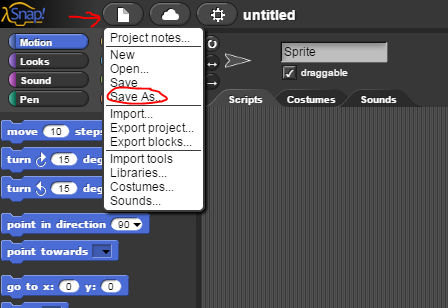

# Lab 2.1 - Squares and Triangles Redux

In this lab, you will rewrite your Snap! programs from Lab 1.3 to draw shapes using loops.

## Part 1: Back In Time

1. Open your solution to the original "Squares and Triangles and Stars, Oh My!" activity.  Go to the "File" menu and select "Save as..." to give your project a new name.

    

## Part 2: Simplifying your scripting

1. Look at your script to draw a square.  It is probably quite long and has lots of repeated blocks.  Using what you have learned about loops, rewrite this script to be shorter and have less redundancy.  Make sure that your script still works as originally intended.

2. Now modify your other shape scripts to also use loops.  In all cases, try to have as few blocks and as little redundancy as possible while still keeping your script easy to read and understand.

## Part 3: Adding More Shapes

1. Add script to your program to draw the extra shapes below.  Follow all the original guidelines (different color and line thickness for each shape, say the name while drawing) and use loops to keep your scripts as short as possible.

    | _When this key is pressed..._ | _Draw a..._                |
    | ----------------------------- | -------------------------- |
    | 7                             | Decagon (10-sided polygon) |
    | 8                             | Circle                     |

You may not be able to draw a true circle, but you should get as close as you can.

## Grading Scheme/Rubric

| **Lab 2.1 Criteria**                | Points         |
| ----------------------------------- | -------------- |
| Part 2 | |
| 2.2 Square using loop               | 0.5 |
| Part 3                           |          |
| Decagon                             | 0.5 |
| Circle                              | 0.5 |
| Minimum redundancy in all           | 0.5 |
| **PROJECT TOTAL**                   | **2.0 points** |
